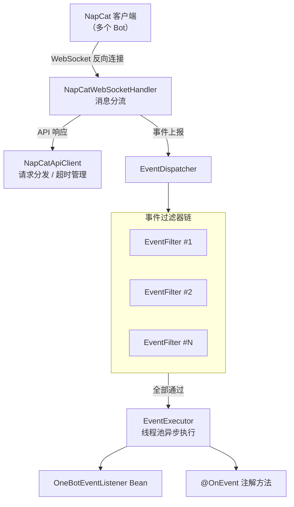

# NapCat Spring Boot Starter

[]()

基于 Spring Boot 3 的 [NapCat](https://github.com/NapNeko/NapCatQQ) QQ 机器人 SDK，实现 [OneBot v11](https://11.onebot.dev/) 协议。通过反向 WebSocket 接收 NapCat 的事件上报，并提供类型安全的异步 API 客户端来调用 OneBot Action。由于该项目的API和事件完全参照NapCat实现，在使用时可参考NapCat的文档与项目源代码。

***

## 特性

- **反向 WebSocket** — SDK 作为 WebSocket 服务端，NapCat 主动连接，支持多 Bot 同时在线
- **全量 API** — 覆盖消息、群组、好友、文件、系统、扩展等 OneBot v11 全部 Action，返回 `CompletableFuture` 异步调用
- **事件系统** — 支持 `@OnEvent` 注解 + `OneBotEventListener` 接口两种方式处理事件，按继承层级级联分发
- **事件过滤器链** — 可注册多个 `EventFilter` Bean，事件在分发前经过滤链，全部通过才分发
- **Bot 生命周期监听** — `BotEventListener` 监听 Bot 上线/离线
- **异步解耦** — 事件处理在独立线程池执行，不阻塞 WebSocket I/O 线程
- **心跳监控** — 自动检测 Bot 心跳超时并清理离线会话
- **Token 鉴权** — 支持静态 Token 和动态注册两种鉴权方式
- **超时管理** — API 调用可配置超时，支持优雅取消

***

## 快速开始

### 1. 添加依赖

发布到 JitPack 后：

```xml
<!-- pom.xml -->
<repositories>
    <repository>
        <id>jitpack.io</id>
        <url>https://jitpack.io</url>
    </repository>
</repositories>

<dependencies>
    <dependency>
        <groupId>com.github.zhygtx</groupId>
        <artifactId>napcat-spring-boot-starter</artifactId>
        <version>0.0.1</version>
    </dependency>
</dependencies>
```

### 2. 配置 `application.yml`

```yaml
server:
  port: 8080                          # SDK WebSocket 服务端口

napcat:
  ws:
    server:
      enable: true                    # 是否启用 WebSocket 服务
      url: /ws/bot                    # WebSocket 端点路径
    timeout: 30                       # 连接超时（秒）
    heartbeat-timeout: 60             # 心跳超时（秒），超时视为离线
    heartbeat-min-interval: 5         # 心跳最小间隔（秒），防高频洪水
    enable-token: false               # 是否启用 Token 鉴权
    token-value: ""                   # 静态 Token（空则启用动态注册）

  task-pool:
    core-pool-size: 50                # 事件处理线程池核心线程数
    max-pool-size: 100                # 最大线程数
    queue-capacity: 5000              # 任务队列容量
    keep-alive-time: 60               # 空闲线程存活时间（秒）
    thread-name-prefix: "NapCatTaskPool-"

  api:
    timeout: 30                       # API 调用超时（秒）
    max-pending: 500                  # 最大待处理请求数

  log:
    ignore-heartbeat-log: true        # 是否忽略心跳日志
    log-max-length: 500               # 日志中消息内容最大长度
```

### 3. NapCat 端配置

在 NapCat 的 WebUI → 网络配置中，新建一个 **WebSocket 客户端**（反向 WS），URL 填入：

```
ws://localhost:8080/<napcat.ws.server.url>/<pathSuffix>
```

- `<napcat.ws.server.url>` 是 SDK 端配置的 WebSocket 端点路径（默认 `/ws/bot`）
- `<pathSuffix>` 是**自定义路径后缀**，没配置的话就省略

`pathSuffix` 仅用于 SDK 端识别连接，可以用任意字符串（如 `my-bot-001`、`bot-alpha` 等）：

```
ws://localhost:8080/ws/bot/my-bot-001
```

SDK 会从 URL 中提取 `pathSuffix = "my-bot-001"`，后续通过它关联 Bot 身份和鉴权 Token。

### 4. Token 鉴权

SDK 支持两种 Token 鉴权方式，通过 `napcat.ws.enable-token` 开关控制。

#### 方式一：静态 Token（适合简单场景 / 单 Bot）

在配置文件中直接写死一个 Token，所有连接共用：

```yaml
napcat:
  ws:
    enable-token: true
    token-value: "my-shared-secret"
```

NapCat 端在 WebSocket 连接时，需在请求头中携带token： `my-shared-secret`。

#### 方式二：动态注册（适合多 Bot，各用不同 Token）

注入 `BotRegistrar`，在应用启动时逐个注册每个 Bot 的 `pathSuffix` 和对应的 Token：

```java
import com.github.zhygtx.napcat.auth.BotRegistrar;
import jakarta.annotation.PostConstruct;
import org.springframework.beans.factory.annotation.Autowired;
import org.springframework.stereotype.Component;

@Component
public class BotInit {

    @Autowired
    private BotRegistrar botRegistrar;  // 注入 Bot 注册管理器

    @PostConstruct
    public void init() {
        // register(pathSuffix, token)
        // pathSuffix 对应连接 URL 中 /ws/bot/ 后面的路径片段
        // token 为 null 表示该 Bot 不需要 Token 校验

        botRegistrar.register("my-bot-001", "token-abc-123");  // Bot 001 需要 Token
        botRegistrar.register("my-bot-002", "token-xyz-456");  // Bot 002 用另一个 Token
        botRegistrar.register("my-bot-003", null);              // Bot 003 不需要 Token
    }
}
```

NapCat 端连接时：

- URL 写 `ws://localhost:8080/ws/bot/my-bot-001`
- token： `token-abc-123`

SDK 会按 `pathSuffix` 查找注册表，比对 Token，只有匹配才允许握手。

> 如果既没有配置静态 `token-value`，也没有调用 `botRegistrar.register()`，启用 Token 鉴权后**所有连接都会被拒绝**。启动日志会打印警告提示。

***

## API使用指南

### 发送消息（同步 / 异步）

`NapCat` 是核心操作类，注入后即可调用所有 OneBot API。所有方法返回 `CompletableFuture`，支持同步等待和异步回调两种方式。

```java
import com.github.zhygtx.napcat.api.NapCat;
import com.github.zhygtx.napcat.api.response.message.SendMsgData;
import org.springframework.stereotype.Component;
import org.springframework.beans.factory.annotation.Autowired;
import java.util.concurrent.TimeUnit;

@Component
public class MessageService {

    @Autowired
    private NapCat napCat;  // 注入核心 API 操作类

    /** 同步发送群消息，等待 30 秒获取结果 */
    public void sendGroupMessageSync(long botQQ) {
        try {
            // botQQ: 目标Bot的QQ号, 123456L: 群号, "hello": 消息内容, false: 不转义CQ码
            SendMsgData data = napCat.sendGroupMsg(botQQ, 123456L, "hello", false)
                    .get(30, TimeUnit.SECONDS)  // 同步等待最多 30 秒
                    .getData();                  // 获取业务数据
            System.out.println("消息已发送, messageId: " + data.getMessageId());
        } catch (Exception e) {
            e.printStackTrace();
        }
    }

    /** 异步发送私聊消息，不阻塞当前线程 */
    public void sendPrivateMessageAsync(long botQQ, String userId) {
        napCat.sendPrivateMsg(botQQ, userId, "你好！", false)
                .thenAccept(response -> {
                    if (response.isSuccess()) {
                        System.out.println("私聊消息发送成功");
                    } else {
                        System.out.println("发送失败: " + response.getRetcode());
                    }
                });
    }

    /**
     * 发送后不关心返回值（fire-and-forget），适用于高频场景，
     * 不需要等待结果也不需要处理失败的场合
     */
    public void sendGroupMessageFireAndForget(long botQQ) {
        // 提交即走，不阻塞，失败也无感知
        napCat.sendGroupMsg(botQQ, 123456L, "定时推送内容", false);
        // 没有 .get() 也没有 .thenAccept()，纯粹触发一下
    }
}
```

### 处理事件（接口方式）

实现 `OneBotEventListener` 接口并注册为 Spring Bean，即可接收所有类型的 OneBot 事件。你只需覆写关心的方法。

```java
import com.github.zhygtx.napcat.event.OneBotEventListener;
import com.github.zhygtx.napcat.event.message.GroupMessageEvent;
import com.github.zhygtx.napcat.event.message.PrivateMessageEvent;
import com.github.zhygtx.napcat.event.notice.GroupIncreaseNoticeEvent;
import org.slf4j.Logger;
import org.slf4j.LoggerFactory;
import org.springframework.stereotype.Component;

@Component
public class MyEventListener implements OneBotEventListener {

    private static final Logger log = LoggerFactory.getLogger(MyEventListener.class);

    /** 收到群聊消息时触发 */
    @Override
    public void onGroupMessage(Long botQQ, GroupMessageEvent event) {
        log.info("[Bot:{}] 群[{}] 成员[{}]: {}",
                botQQ, event.getGroupId(), event.getUserId(), event.getRawMessage());
        // 在这里编写业务逻辑，如关键词回复、命令处理等
    }

    /** 收到私聊消息时触发 */
    @Override
    public void onPrivateMessage(Long botQQ, PrivateMessageEvent event) {
        log.info("[Bot:{}] 私聊[{}]: {}", botQQ, event.getUserId(), event.getRawMessage());
    }

    /** 有新成员入群时触发 */
    @Override
    public void onGroupIncrease(Long botQQ, GroupIncreaseNoticeEvent event) {
        log.info("[Bot:{}] 群[{}] 新成员: {} 入群了",
                botQQ, event.getGroupId(), event.getUserId());
    }
}
```

> 接口中所有方法都是 `default` 且按继承层级**级联分发**。例如 `GroupNormalMessageEvent` 会同时触发 `onGroupNormalMessage()` 和 `onGroupMessage()` 两个方法。

### 处理事件（注解方式）

使用 `@OnEvent` 注解标记方法，方法签名必须是 `void methodName(Long botQQ, XxxEvent event)`。

```java
import com.github.zhygtx.napcat.event.OnEvent;
import com.github.zhygtx.napcat.event.message.GroupMessageEvent;
import com.github.zhygtx.napcat.event.notice.GroupDecreaseKickNoticeEvent;
import org.slf4j.Logger;
import org.slf4j.LoggerFactory;
import org.springframework.stereotype.Component;

@Component
public class MyAnnotatedHandlers {

    private static final Logger log = LoggerFactory.getLogger(MyAnnotatedHandlers.class);

    /** 处理群聊消息 —— 注解方式 */
    @OnEvent
    public void handleGroupMessage(Long botQQ, GroupMessageEvent event) {
        log.info("收到群消息: {}", event.getRawMessage());
    }

    /** 处理群成员被踢出事件 */
    @OnEvent
    public void handleMemberKick(Long botQQ, GroupDecreaseKickNoticeEvent event) {
        log.info("群[{}] 成员[{}] 被管理员[{}] 踢出",
                event.getGroupId(), event.getUserId(), event.getOperatorId());
    }
}
```

### 事件过滤（过滤器链）

实现 `EventFilter` 接口并注册为 Spring Bean，可在事件分发前进行拦截。支持注册多个过滤器，**全部返回** **`true`** **才放行**（AND 逻辑）。

拦截发生在事件解析之后、提交线程池之前，被拦截的事件不会进入线程池，节省资源。

```java
import com.github.zhygtx.napcat.event.EventFilter;
import com.github.zhygtx.napcat.event.message.GroupMessageEvent;
import com.github.zhygtx.napcat.event.message.MessageSentEvent;
import org.springframework.context.annotation.Bean;
import org.springframework.context.annotation.Configuration;
import java.util.Set;

@Configuration
public class EventFilterConfig {

    /** 过滤掉 Bot 自己发送的消息，防止死循环 */
    @Bean
    public EventFilter noSelfSentFilter() {
        // message_sent 类事件是 Bot 自己发出的消息，拦截它们
        return (botQQ, event) -> !(event instanceof MessageSentEvent);
    }

    /** 只处理群聊消息，私聊全部丢弃 */
    @Bean
    public EventFilter groupOnlyFilter() {
        return (botQQ, event) -> event instanceof GroupMessageEvent;
    }

    /** 黑名单过滤：特定用户的消息直接丢弃 */
    @Bean
    public EventFilter blacklistFilter() {
        Set<String> blacklist = Set.of("123456789", "987654321");
        return (botQQ, event) -> {
            // 如果事件有 getUserId() 方法，则检查黑名单
            // 简化示例：仅对 GroupMessageEvent 检查
            if (event instanceof GroupMessageEvent g) {
                return !blacklist.contains(String.valueOf(g.getUserId()));
            }
            return true;  // 其他类型事件放行
        };
    }
}
```

### 监听 Bot 上线/离线

实现 `BotEventListener` 接口，在 Bot 连接建立或断开时执行自定义逻辑。

```java
import com.github.zhygtx.napcat.event.BotEventListener;
import org.slf4j.Logger;
import org.slf4j.LoggerFactory;
import org.springframework.stereotype.Component;

@Component
public class MyBotListener implements BotEventListener {

    private static final Logger log = LoggerFactory.getLogger(MyBotListener.class);

    /** Bot 上线：WebSocket 建立连接时调用 */
    @Override
    public void botOnline(Long botQQ) {
        log.info("Bot {} 已上线，可以开始处理消息", botQQ);
    }

    /** Bot 离线：WebSocket 断开连接时调用 */
    @Override
    public void botOffline(Long botQQ) {
        log.info("Bot {} 已离线", botQQ);
    }
}
```

***

## 架构概览



***

## 事件类型

### 元事件 (Meta)

| 事件   | Java 类                      |
| ---- | --------------------------- |
| 生命周期 | `LifecycleMetaEvent`        |
| 连接成功 | `LifecycleConnectMetaEvent` |
| 心跳   | `HeartbeatMetaEvent`        |

### 消息事件 (Message)

| 事件    | Java 类                      |
| ----- | --------------------------- |
| 私聊消息  | `PrivateMessageEvent`       |
| 好友私聊  | `PrivateFriendMessageEvent` |
| 群临时会话 | `PrivateGroupMessageEvent`  |
| 群聊消息  | `GroupMessageEvent`         |
| 普通群聊  | `GroupNormalMessageEvent`   |

### 消息发送事件 (Message Sent)

| 事件       | Java 类                      |
| -------- | --------------------------- |
| Bot 发送私聊 | `PrivateMessageSentEvent` 等 |
| Bot 发送群聊 | `GroupMessageSentEvent` 等   |

### 通知事件 (Notice)

群管理员变动、群禁言、群成员增减、群消息撤回、群文件上传、群名片变更、精华消息、戳一戳、输入状态、点赞、头衔变更等，覆盖 OneBot v11 全部通知类型。

### 请求事件 (Request)

好友申请、加群申请、邀请入群。

***

## 配置参考

所有配置项位于前缀 `napcat` 下，参见上面 [配置](#2-配置-applicationyml) 章节。

自定义 `application.yml` 示例（非默认值）：

```yaml
napcat:
  ws:
    server:
      url: /my-bot-endpoint           # 自定义 WebSocket 路径
    timeout: 60                       # 60 秒连接超时
    heartbeat-timeout: 120            # 2 分钟无心跳即离线
    enable-token: true                # 启用 Token 鉴权
    token-value: "your-secret-token"  # 鉴权 Token
  task-pool:
    core-pool-size: 20                # 轻量场景，减少线程数
  log:
    ignore-heartbeat-log: false       # 调试时显示心跳日志
```

***

## 要求

- Java 21+
- Spring Boot 3.x
- NapCat QQ
